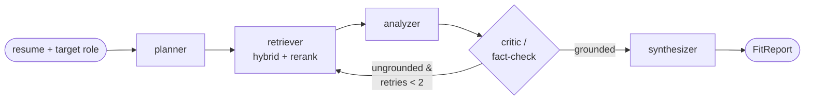

# Agentic Job-Fit Analyzer

Given a resume and a target role, this service retrieves relevant job postings,
analyzes fit with a self-correcting agent, and returns a **structured report** —
matched skills, gaps (with concrete next steps), and tailored bullet rewrites.

A portfolio project demonstrating three things: an **agent loop** (not just an LLM
call), **RAG depth** (hybrid retrieval + reranking), and **eval discipline**
(validated metrics, not vibes).

## Architecture

LangGraph state machine with a critic that loops back to the retriever when the
draft analysis isn't grounded in retrieved evidence (capped at 2 retries):



Every node returns a Pydantic model — no free-form text. The final `FitReport`
carries a fit score, matched skills, gaps with next steps, bullet rewrites, and
the evidence postings used.

## Retrieval ablation (the headline result)

Posting-level metrics over a 16-role gold set (3,049 relevance judgments) on the
full corpus (~4,200 postings indexed). Relevance is defined by target-role title
match — an objective, retrieval-independent proxy (see `evals/gold.py`).

| system | NDCG@5 | NDCG@10 | P@5 | MRR | latency p50 |
|---|---|---|---|---|---|
| BM25-only | 0.664 | 0.680 | 0.675 | 0.763 | 1.8s |
| dense-only (baseline) | 0.765 | 0.763 | 0.775 | 0.849 | 2.1s |
| hybrid (dense + BM25, RRF) | 0.766 | 0.756 | 0.775 | 0.818 | 3.5s |
| **hybrid + cross-encoder rerank** | **0.860** | **0.835** | **0.838** | **0.950** | 18.9s |

**Hybrid retrieval + reranking lifted NDCG@5 from 0.765 (dense baseline) to 0.860.**

The eval harness also caught a regression: the first reranker tried
(`ms-marco-MiniLM`, web-QA domain) *hurt* NDCG@5 (0.713); swapping to a
retrieval-domain reranker (`bge-reranker-base`) produced the result above. Catching
that is the point of measuring instead of assuming. Reproduce with
`python -m evals.retrieval`.

## Stack

- **Python 3.11+**, **FastAPI**
- **Postgres + pgvector** (hosted free Neon; `docker-compose.yml` also provided)
- **Embeddings**: local `BAAI/bge-small-en-v1.5` (384-dim) by default — free, no
  rate limits. Pluggable via `EMBEDDING_PROVIDER` (`gemini`, `openai` reachable).
- **Retrieval**: dense (pgvector cosine) + BM25 (`rank-bm25`), reciprocal rank
  fusion, then a `bge-reranker-base` cross-encoder. Dense-only stays reachable via
  `DENSE_ONLY=true` (the ablation baseline).
- **Agent**: LangGraph; **Google Gemini** (`gemini-2.5-flash`) for the nodes.
- **Corpus**: job postings from public ATS APIs (Greenhouse + Lever).

## Quickstart

```bash
python -m venv .venv && source .venv/bin/activate    # Windows: .venv\Scripts\activate
pip install -r requirements.txt
cp .env.example .env                                  # set GOOGLE_API_KEY, DATABASE_URL
python -m ingest.scrape                               # collect postings -> data/raw/
python -m ingest.index --recreate                     # chunk + embed + index (local, free)
uvicorn app.main:app --reload                         # serve
```

### Analyze a resume

```bash
curl -s localhost:8000/analyze -H 'content-type: application/json' \
  -d '{"resume": "<resume text>", "target_role": "Machine Learning Engineer"}'
```

Returns `{ "report": FitReport, "meta": { retries, llm_tokens, evidence_count, latency_s } }`.

## Commands

| Task | Command |
| --- | --- |
| Run app | `uvicorn app.main:app --reload` |
| Run tests | `pytest` |
| Scrape corpus | `python -m ingest.scrape` |
| Build index | `python -m ingest.index --recreate` |
| Verify DB + pgvector | `python -m app.db` |
| Retrieval ablation | `python -m evals.retrieval` |

## Status & honest caveats

Phases 0–4 and 6 are complete (33 tests passing). Known limitations, kept visible
rather than hidden:

- **Generation eval (Phase 5) not done.** The retrieval ablation above is validated;
  the LLM-as-judge for the *generated report* (faithfulness/relevance/actionability)
  and its human-κ validation are **future work** — there is intentionally no κ number
  to avoid reporting an unvalidated one.
- **Gold-set relevance is a title-match proxy**, not human judgment — fine for
  comparing retrievers, but not a substitute for human labels.
- **Latency**: a full `/analyze` run is ~1–2.5 min (the reranker is ~19s on CPU and
  the agent makes several Gemini calls, sometimes with a retry). Tunable via fewer
  rerank candidates, a smaller reranker, or GPU.
- **Index coverage**: ~4,200 of 4,500 postings (a re-index was interrupted at 94%;
  ample for the eval).
