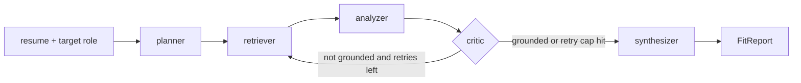

# Architecture

The project has four main pieces: ingestion, retrieval, the LangGraph workflow, and the API layer.

## 1. Ingestion and indexing

```text
public ATS APIs -> raw JSONL -> clean text -> section chunks -> embeddings -> Postgres/pgvector
```

Postings are scraped from public Greenhouse and Lever endpoints. Each posting is normalized into a common schema, then split into section-aware chunks such as responsibilities, requirements, qualifications, summary, and other.

The default embedding model is `BAAI/bge-small-en-v1.5`, which keeps local indexing cheap and repeatable. The same indexing path can also use Gemini or OpenAI embeddings through environment variables.

## 2. Retrieval

The retriever can run in a few modes:

```text
resume / target-role query
        |
        +--> dense search over pgvector
        +--> BM25 sparse search
        |
        v
reciprocal-rank fusion
        |
        v
cross-encoder reranker
        |
        v
top evidence postings
```

Dense-only retrieval is kept as an ablation baseline. The main path fuses dense and BM25 results with reciprocal-rank fusion, then reranks the fused candidates with `BAAI/bge-reranker-base`.

## 3. Agent workflow



The planner creates retrieval queries. The retriever gathers job-posting evidence. The analyzer drafts matched skills, gaps, and bullet rewrites. The critic checks whether the draft is grounded in the resume or retrieved postings. If needed, it sends follow-up queries back to retrieval. The synthesizer produces the final structured report.

## 4. API

The FastAPI app exposes:

- `GET /health`
- `POST /analyze`

`POST /analyze` accepts a resume string and a target role. It returns the final `FitReport` plus metadata such as retry count, token count, evidence count, and latency.

## 5. Evaluation

Retrieval evaluation runs at the posting level. Chunk hits are deduplicated to posting IDs before computing precision, recall, NDCG, MRR, and latency. The current gold set is title-match based, so it is useful for retrieval comparison but not a full human judgment of job fit.
